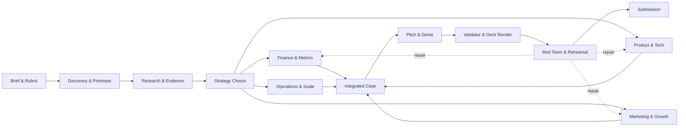

# CaseKit

Portable, evidence-led operating system for case competitions and hackathons.

CaseKit ช่วยให้ทีม Research, Finance, Product/Tech, Marketing, Operations, Pitch, Deck, Validation และ Red Team ทำงานด้วยข้อเท็จจริง สมมติฐาน และตัวเลขชุดเดียวกัน เป้าหมายไม่ใช่การรับประกันชัยชนะ แต่คือเพิ่มคุณภาพของเหตุผล ความน่าเชื่อถือ ความเป็นไปได้ และความพร้อมต่อคำถามกรรมการ

> No number without a formula. No assumption without an ID. No external claim without a source. No recommendation without an owner, KPI, time horizon, and downside case.

## System



CaseKit uses stable IDs—`CLM`, `SRC`, `ASM`, `MET`, `PRM`, `DEC`, `RSK`, and `EXP`—so every important slide claim can be traced back to evidence, a formula, or an explicit uncertainty.

## Skills

| Skill | Owns |
|---|---|
| `casekit-orchestrator` | brief, rubric, workflow, shared ledgers, integration |
| `casekit-discovery` | problem event, stakeholder, premises, opportunity frames, validation gate |
| `casekit-research` | evidence, market/customer/competitor research, source quality, verification |
| `casekit-strategy` | options, strategic choice, weighted comparison, rejected alternatives, confidence |
| `casekit-finance` | revenue-first model, CAC/LTV/payback, MRR/ARR, GRR/NRR, cohort-to-cash plan, AR, budget variance, scenarios, sensitivity |
| `casekit-product-tech` | MVP, architecture, feasibility, risk controls, demo |
| `casekit-engineering` | implementation, contracts, code quality, tests, CI, release, operations |
| `casekit-marketing-growth` | positioning, CEO vision/proof portfolio, GTM, growth loops, launch/event, funnel ownership, experiments |
| `casekit-operations` | operating model, RACI, capacity, roadmap, governance, scale gates |
| `casekit-pitch` | narrative, slide storyboard, scripts, demo choreography, Q&A |
| `casekit-validator` | source, reference, financial, strategic, deck, rubric, submission audits |
| `casekit-deck` | canonical deck spec, editable PowerPoint, source footers, visual QA |
| `casekit-red-team` | rubric attack, contradiction checks, stress tests, repair queue |

## Install

CaseKit follows the open Agent Skills format. One command installs the same canonical skills for Codex, Claude Code, Gemini CLI, and Google Antigravity at user scope:

```bash
python3 install.py
```

For a repository-scoped team installation:

```bash
python3 install.py --scope project --project-root /path/to/project
```

This writes `.agents/skills/` for Codex, Gemini CLI, and Antigravity, plus `.claude/skills/` for Claude Code. Install a single adapter with `--platform codex|claude|gemini|antigravity`, or use `--target` for another client. The installer refuses to overwrite existing skills unless `--force` is explicitly provided:

```bash
python3 install.py --force
```

Restart, reload, or refresh the AI client's skill list after installation. See [PORTABILITY.md](PORTABILITY.md) for paths, legacy adapters, direct invocation, and unsupported-client fallback.

For an AI that cannot discover local skills, create one uploadable context file:

```bash
python3 scripts/export_context.py --all --output casekit-context.md
```

For editable PowerPoint rendering, PDF intake, and Excel/CSV sync, install the runtime dependencies once:

```bash
python3 -m pip install -r requirements.txt
```

## Start a competition

### Obsidian-first quick start

Install the local runtime, create a workspace, and open that new folder as an Obsidian vault:

```bash
python3 -m venv .venv
source .venv/bin/activate
python3 -m pip install -r requirements.txt
python3 casekit.py doctor --strict
python3 casekit.py init ../my-competition --brief /path/to/brief.pdf --rubric /path/to/rubric.pdf
```

The resulting workspace contains Markdown notes, CSV ledgers, spreadsheet mapping, and project-scoped skills for Codex, Claude Code, Gemini CLI, and Antigravity. Start at `README-START-HERE.md`. See [OBSIDIAN.md](OBSIDIAN.md) for editable numbers and Excel workflow.

### Team and idea workflow

Use one private repository for each live case; CaseKit itself can remain public. Each teammate creates a named Git branch, works in the shared case workspace, and submits a small pull request. The Integrator owns shared metrics and the deck spec, then runs the validator after every merge.

Chat and AI-generated Markdown are drafts by default. Keep throwaway ideas in chat; use `idea-backlog.csv` only when an idea needs team review. It cannot enter the model or deck until a human promotes it to `accepted-for-test` (with an `EXP` ID) or `accepted-for-case` (with a `DEC` ID and affected artifacts). See `README-START-HERE.md` in a generated workspace for ready-to-use prompts and rules.

### Manual start

Create a controlled project workspace:

```bash
python3 skills/casekit-orchestrator/scripts/new_case.py ./my-competition
```

Then invoke with provider-neutral language:

```text
Use casekit-orchestrator to analyze this brief, select the correct operating mode, and build a complete judge-ready case workspace.
```

Specialist example:

```text
Use casekit-finance to estimate launch revenue, required reach, conversion, activity throughput, cost, break-even, scenarios, sensitivity, and kill criteria. Defend every material assumption.
```

Unit-economics example:

```bash
python3 skills/casekit-finance/scripts/unit_economics.py \
  skills/casekit-finance/assets/unit-economics-input.example.json \
  --pretty
```

CFO operating-plan example (run separately for base, downside, and upside):

```bash
python3 skills/casekit-finance/scripts/cfo_operating_plan.py \
  skills/casekit-finance/assets/cfo-operating-plan-input.example.json \
  --output ./my-competition/15-cfo-operating-plan.json --pretty
```

Validate and render after the ledgers and deck spec are populated:

```bash
python3 skills/casekit-validator/scripts/audit_case.py ./my-competition
python3 skills/casekit-deck/scripts/render_deck.py ./my-competition/12-deck-spec.json ./my-competition/submission.pptx
```

## Operating modes

- `Sprint` — compressed workflow for short deadlines; focus on highest-risk unknowns.
- `Standard` — default competition workflow with synthesis and verification.
- `Deep` — final-round or regulated/high-stakes workflow with deeper triangulation and validation.

## Optional integrations

- [gstack](https://github.com/garrytan/gstack) can be installed separately for coded prototype planning, design review, report-only QA, security review, and shipping. CaseKit remains the source of truth.
- [startup-skill](https://github.com/ferdinandobons/startup-skill) informed several discovery and startup-analysis patterns. CaseKit contains original competition-focused adaptations; installing it is optional.

See [REFERENCES.md](REFERENCES.md) and [THIRD_PARTY_NOTICES.md](THIRD_PARTY_NOTICES.md) for methodology provenance and license notices.

## Validate

Run before committing or opening a pull request:

```bash
python3 scripts/validate_suite.py
```

The validator checks Agent Skills metadata, provider-neutral source content, universal/provider/legacy install paths, context export, project generation, cross-ledger references, source metadata, installer replacement behavior, finance model paths, CAC/LTV/payback and recurring-revenue reconciliation, cohort-to-cash/AR reconciliation, invalid retention, failed thresholds, tampered economics, rubric scoring, deck generation, and PowerPoint package integrity. GitHub Actions runs the same command on pushes and pull requests.

## Repository layout

```text
casekit/
├── .github/                  # CI and contribution templates
├── casekit.py                # clone-to-case CLI and runtime checks
├── scripts/                  # suite-level validation
├── examples/                 # synthetic end-to-end competition fixture
├── skills/                   # installable CaseKit skills
├── AGENTS.md                 # guidance for AI contributors
├── OBSIDIAN.md               # Obsidian and spreadsheet workflow
├── CONTRIBUTING.md           # human contribution rules
├── REFERENCES.md             # methodology provenance
├── PORTABILITY.md            # provider paths and compatibility contract
├── THIRD_PARTY_NOTICES.md    # upstream notices
├── casekit.json              # package manifest
├── install.py                # safe installer
├── requirements.txt          # editable deck renderer dependency
└── LICENSE                   # MIT
```

## License

CaseKit is released under the [MIT License](LICENSE). External projects retain their own copyright and licenses.
