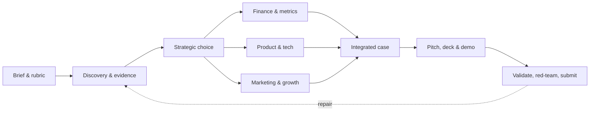

<p align="center">
  
</p>

<h1 align="center">CaseKit</h1>

<p align="center">
  <a href="https://github.com/Faeif/casekit/actions/workflows/validate.yml"></a>
  <a href="LICENSE"></a>
  
  
</p>

<p align="center"><strong>Turn a competition brief into an evidence-backed, judge-ready case—without losing traceability between research, strategy, financials, product, and the final deck.</strong></p>

<p align="center">
  <a href="#start-in-5-minutes">Get started</a> ·
  <a href="#what-you-get">What you get</a> ·
  <a href="#team-workflow">Team workflow</a> ·
  <a href="OBSIDIAN.md">Obsidian guide</a> ·
  <a href="CONTRIBUTING.md">Contribute</a>
</p>

> **The CaseKit standard:** no number without a formula; no assumption without an ID; no external claim without a source; no recommendation without an owner, KPI, horizon, and downside case.

## Why CaseKit

Most team failures are integration failures: research is disconnected from the model, the model is disconnected from the strategy, and the deck makes claims nobody can defend. CaseKit gives every workstream a shared operating language—so the team can move quickly *and* answer the judges' next question.

| Instead of | CaseKit creates |
| --- | --- |
| scattered links and notes | an evidence ledger with source quality and claim IDs |
| hand-wavy numbers | a revenue-first model, unit economics, scenarios, and sensitivities |
| parallel work that does not connect | one shared metric tree, decision log, and risk register |
| a beautiful but fragile deck | traceable claims, source footers, red-team checks, and rehearsal Q&A |

## Start in 5 minutes

```bash
git clone https://github.com/Faeif/casekit.git
cd casekit
python3 install.py --scope project --project-root /path/to/your-case
python3 casekit.py init /path/to/your-case --layout clean --team "Alice,Bob,Carol"
```

Open the newly created case folder in Obsidian (optional), then tell your AI:

```text
Use casekit-orchestrator to analyze this brief, select the correct operating mode,
and build a complete judge-ready case workspace.
```

Restart or refresh your AI client after installation. The same canonical skills work with Codex, Claude Code, Gemini CLI, and Google Antigravity. See [PORTABILITY.md](PORTABILITY.md) if your client is not listed.

## What you get



### 13 specialist skills, one integrated case

| Workstream | Skill | Outcome |
| --- | --- | --- |
| Integration | `orchestrator` | brief, rubric, shared ledgers, workflow and synthesis |
| Problem | `discovery` | problem event, stakeholders, premises, opportunity frames |
| Evidence | `research` | trustworthy sources, customer/market/competitor research |
| Choice | `strategy` | options, weighted choice, rejected alternatives, confidence |
| Economics | `finance` | revenue-first model, CAC/LTV, payback, scenarios, sensitivity |
| Build | `product-tech` + `engineering` | MVP, architecture, tests, delivery and production readiness |
| Growth | `marketing-growth` | positioning, GTM, funnel, growth loops, experiments |
| Execution | `operations` | RACI, capacity, roadmap, scale gates |
| Win the room | `pitch` + `deck` | narrative, slide system, editable PowerPoint, Q&A |
| Quality | `validator` + `red-team` | audits, rubric attacks, stress tests, repair queue |

<details>
<summary><strong>Explore all 13 skills</strong></summary>

<br />

| Skill | Owns |
| --- | --- |
| `casekit-orchestrator` | brief, rubric, workflow, shared ledgers, and integration |
| `casekit-discovery` | problem event, stakeholders, premises, opportunity frames, and validation gates |
| `casekit-research` | evidence, market/customer/competitor research, source quality, and verification |
| `casekit-strategy` | options, strategic choice, weighted comparison, rejected alternatives, and confidence |
| `casekit-finance` | revenue-first model, CAC/LTV/payback, recurring revenue, cohort-to-cash, AR, scenarios, and sensitivity |
| `casekit-product-tech` | MVP, architecture, feasibility, risk controls, and demo |
| `casekit-engineering` | implementation, contracts, code quality, tests, CI, release, and operations |
| `casekit-marketing-growth` | positioning, vision, GTM, growth loops, launch/event, funnel ownership, and experiments |
| `casekit-operations` | operating model, RACI, capacity, roadmap, governance, and scale gates |
| `casekit-pitch` | narrative, slide storyboard, scripts, demo choreography, and Q&A |
| `casekit-deck` | canonical deck spec, editable PowerPoint, source footers, and visual QA |
| `casekit-validator` | source, financial, strategic, deck, rubric, and submission audits |
| `casekit-red-team` | rubric attacks, contradiction checks, stress tests, and repair queue |

</details>

### The evidence chain

CaseKit uses stable IDs—`CLM`, `SRC`, `ASM`, `MET`, `PRM`, `DEC`, `RSK`, and `EXP`—to make material claims auditable from slide back to source, formula, and uncertainty.

```text
Claim (CLM) → Source (SRC) / Assumption (ASM) → Metric (MET) → Decision (DEC) → Slide
```

## Team workflow

For a live competition, create **one private repository per case**. Keep CaseKit as the reusable public toolkit.

1. One teammate creates the workspace with `--layout clean` and shares the case repo.
2. Put original brief, rubric, and raw materials in `01-INPUTS/`.
3. Each teammate works in only their own folder in `02-TEAM/`.
4. An Integrator promotes approved work into `03-OFFICIAL/` and the final deck.
5. Run validation before every PR, rehearsal, and submission.

This keeps exploration safe: chat output and unconfirmed ideas stay in personal drafts; only a decision or test turns an idea into an official artifact. Generated workspaces include `README-START-HERE.md` and `TEAM-WORKFLOW.md` with the exact workflow.

## Choose your mode

| Mode | Use when | Focus |
| --- | --- | --- |
| **Sprint** | hours, not days | highest-risk unknowns and a defendable minimum case |
| **Standard** | most competitions | full synthesis, validation, and rehearsal |
| **Deep** | final round or high stakes | triangulation, stakeholder validation, and stress testing |

## Installation and runtime

CaseKit follows the open Agent Skills format. Install it for all supported clients at user scope:

```bash
python3 install.py
```

For a repository-scoped team installation:

```bash
python3 install.py --scope project --project-root /path/to/project
```

This writes `.agents/skills/` for Codex, Gemini CLI, and Antigravity, plus `.claude/skills/` for Claude Code. Install a single adapter with `--platform codex|claude|gemini|antigravity`, or use `--target` for another client. The installer refuses to overwrite existing skills unless `--force` is explicitly provided:

```bash
python3 install.py --force
```

Restart, reload, or refresh the AI client's skill list after installation. See [PORTABILITY.md](PORTABILITY.md) for paths, legacy adapters, direct invocation, and unsupported-client fallback.

For an AI that cannot discover local skills, create one uploadable context file:

```bash
python3 scripts/export_context.py --all --output casekit-context.md
```

For editable PowerPoint rendering, PDF intake, and Excel/CSV sync, install the runtime dependencies once:

```bash
python3 -m pip install -r requirements.txt
```

To use editable PowerPoint rendering, PDF intake, and Excel/CSV sync, install the optional runtime dependencies once. For a complete Obsidian-first setup, run:

```bash
python3 -m venv .venv
source .venv/bin/activate
python3 -m pip install -r requirements.txt
python3 casekit.py doctor --strict
python3 casekit.py init ../my-competition --brief /path/to/brief.pdf --rubric /path/to/rubric.pdf
```

The generated workspace contains Markdown notes, CSV ledgers, spreadsheet mapping, and project-scoped skills. Start at `README-START-HERE.md`. See [OBSIDIAN.md](OBSIDIAN.md) for the editable-number and Excel workflow.

### Useful specialist prompt

```text
Use casekit-finance to estimate launch revenue, required reach, conversion, activity throughput, cost, break-even, scenarios, sensitivity, and kill criteria. Defend every material assumption.
```

Unit-economics example:

```bash
python3 skills/casekit-finance/scripts/unit_economics.py \
  skills/casekit-finance/assets/unit-economics-input.example.json \
  --pretty
```

CFO operating-plan example (run separately for base, downside, and upside):

```bash
python3 skills/casekit-finance/scripts/cfo_operating_plan.py \
  skills/casekit-finance/assets/cfo-operating-plan-input.example.json \
  --output ./my-competition/15-cfo-operating-plan.json --pretty
```

Validate and render after the ledgers and deck spec are populated:

```bash
python3 skills/casekit-validator/scripts/audit_case.py ./my-competition
python3 skills/casekit-deck/scripts/render_deck.py ./my-competition/12-deck-spec.json ./my-competition/submission.pptx
```

## Optional integrations

- [gstack](https://github.com/garrytan/gstack) can be installed separately for coded prototype planning, design review, report-only QA, security review, and shipping. CaseKit remains the source of truth.
- [startup-skill](https://github.com/ferdinandobons/startup-skill) informed several discovery and startup-analysis patterns. CaseKit contains original competition-focused adaptations; installing it is optional.

See [REFERENCES.md](REFERENCES.md) and [THIRD_PARTY_NOTICES.md](THIRD_PARTY_NOTICES.md) for methodology provenance and license notices.

## Validate

Run before committing or opening a pull request:

```bash
python3 scripts/validate_suite.py
```

The validator checks Agent Skills metadata, provider-neutral source content, universal/provider/legacy install paths, context export, project generation, cross-ledger references, source metadata, installer replacement behavior, finance model paths, CAC/LTV/payback and recurring-revenue reconciliation, cohort-to-cash/AR reconciliation, invalid retention, failed thresholds, tampered economics, rubric scoring, deck generation, and PowerPoint package integrity. GitHub Actions runs the same command on pushes and pull requests.

## Quality and releases

Every pull request runs the full validation suite. CodeQL analyzes Python on pushes, pull requests, and a weekly schedule; Dependabot opens dependency updates weekly. A pushed version tag such as `v1.1.0` validates the repository again, checks that the tag matches `casekit.json`, and publishes a GitHub Release with an uploadable `casekit-context.md` artifact.

## Repository layout

```text
casekit/
├── .github/                  # CI and contribution templates
├── casekit.py                # clone-to-case CLI and runtime checks
├── scripts/                  # suite-level validation
├── examples/                 # synthetic end-to-end competition fixture
├── skills/                   # installable CaseKit skills
├── AGENTS.md                 # guidance for AI contributors
├── OBSIDIAN.md               # Obsidian and spreadsheet workflow
├── CONTRIBUTING.md           # human contribution rules
├── REFERENCES.md             # methodology provenance
├── PORTABILITY.md            # provider paths and compatibility contract
├── THIRD_PARTY_NOTICES.md    # upstream notices
├── casekit.json              # package manifest
├── install.py                # safe installer
├── requirements.txt          # editable deck renderer dependency
└── LICENSE                   # MIT
```

## License

CaseKit is released under the [MIT License](LICENSE). External projects retain their own copyright and licenses.
