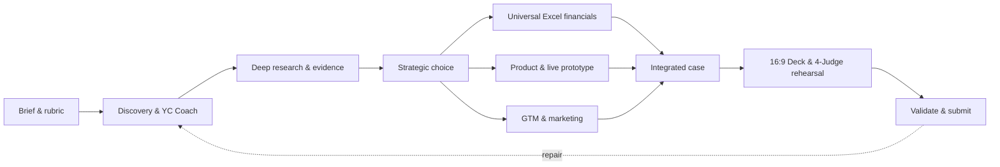

<p align="center">
  
</p>

<h1 align="center">CaseKit</h1>

<p align="center">
  <a href="https://github.com/Faeif/casekit/actions/workflows/validate.yml"></a>
  <a href="LICENSE"></a>
  
  
  
</p>

<p align="center"><strong>The domain-agnostic Venture & Hackathon Operating System. Turn any brief into an evidence-backed, judge-ready case with pluggable financial models, Socratic YC coaching, deep research verification, live prototypes, and 16:9 presentation decks.</strong></p>

<p align="center">
  <a href="#start-in-5-minutes">Get started</a> ·
  <a href="#what-you-get">What you get</a> ·
  <a href="#financial-modeling-engine">Financial models</a> ·
  <a href="#progressive-presets">CLI presets</a> ·
  <a href="#team-workflow">Team workflow</a> ·
  <a href="OBSIDIAN.md">Obsidian guide</a> ·
  <a href="#model-context-protocol-mcp">MCP Server</a> ·
  <a href="CONTRIBUTING.md">Contribute</a>
</p>

> **The CaseKit standard:** no number without a formula; no assumption without an ID; no external claim without a primary source; no market sizing without bottom-up unit economics; no recommendation without an owner, KPI, horizon, and downside case.

## Why CaseKit

Most team failures are integration failures: research is disconnected from the financial model, the model is disconnected from the strategy, and the deck makes claims nobody can defend under judge cross-examination. CaseKit provides a shared operating language—so the team can move with sprint speed *and* defend every number.

| Instead of | CaseKit creates |
| --- | --- |
| scattered links and notes | an evidence ledger with primary source quality, URL archiving, and claim IDs |
| hand-wavy market sizing | 5 pluggable Excel models, bottom-up TAM/SAM/SOM, unit economics, and sensitivities |
| unaligned team drafts | one shared metric tree, decision log, risk register, and Dataview dashboard |
| fragile AI-slop slides | 16:9 widescreen decks, source footers, 4-judge stress tests, and live interactive HTML prototypes |

## Start in 5 minutes

```bash
git clone https://github.com/Faeif/casekit.git
cd casekit
python3 -m pip install -r requirements.txt
python3 casekit.py init /path/to/your-case --preset hackathon-sprint --layout clean --team "Alice,Bob,Carol"
```

Open the newly created case folder in Obsidian (or your preferred editor), then tell your AI:

```text
Use casekit-yc-coach to interrogate our initial premise, establish our beachhead ICP,
and build a complete judge-ready case workspace.
```

Restart or refresh your AI client after installation. Canonical skills work with Codex, Claude Code, Gemini CLI, Cursor, and Google Antigravity. See [PORTABILITY.md](PORTABILITY.md) for custom paths and adapters.

## What you get


```mermaid
flowchart LR
    A[Brief & rubric] --> B[Discovery & YC Coach]
    B --> C[Deep research & evidence]
    C --> D[Strategic choice]
    D --> E[Universal Excel financials]
    D --> F[Product & live prototype]
    D --> G[GTM & marketing]
    E & F & G --> H[Integrated case]
    H --> I[16:9 Deck & 4-Judge rehearsal]
    I --> J[Validate & submit]
    J -. repair .-> B
```

### 14 specialist skills, one integrated case

| Workstream | Skill | Outcome |
| --- | --- | --- |
| Coach | `casekit-yc-coach` | Socratic YC partner, 4 Pillars, 5-Level Funnel, Economic Buyer vs User separation |
| Integration | `casekit-orchestrator` | brief, rubric, shared ledgers, workflow, progressive presets, and synthesis |
| Problem | `casekit-discovery` | problem event, stakeholders, premises, opportunity frames, WTP cost-benefit matrix |
| Evidence | `casekit-research` | primary source hierarchy (SEC 10-K, papers), Rule of 3 triangulation, autopsy matrix |
| Choice | `casekit-strategy` | options, weighted choice, rejected alternatives, confidence, unfair advantage |
| Economics | `casekit-finance` | 5 Excel archetypes, bottom-up TAM, CAC/LTV, payback, SAFE notes, CFO controls |
| Build | `casekit-product-tech` + `casekit-engineering` | MVP, architecture, contracts, delivery, and live interactive HTML prototypes |
| Growth | `casekit-marketing-growth` | positioning, vision, GTM, funnel ownership, growth loops, and launch experiments |
| Execution | `casekit-operations` | RACI, capacity, roadmap, governance, and scale gates |
| Win the room | `casekit-pitch` + `casekit-deck` | 16:9 widescreen PowerPoint, 4-judge rehearsal simulator, 140 WPM speech timer |
| Quality | `casekit-validator` + `casekit-red-team` | structural audits, contradiction checks, rubric stress tests, repair queue |

<details>
<summary><strong>Explore all 14 skills</strong></summary>

<br />

| Skill | Owns |
| --- | --- |
| `casekit-yc-coach` | Socratic co-founder guidance, 4 Pillars, 5-Level Funnel, WTP matrix, and automatic ledger updates |
| `casekit-orchestrator` | brief, rubric, workflow, progressive presets, shared ledgers, and integration |
| `casekit-discovery` | problem event, stakeholders, premises, opportunity frames, and validation gates |
| `casekit-research` | evidence, primary source hierarchy, competitor autopsy matrix, and verification |
| `casekit-strategy` | options, strategic choice, weighted comparison, rejected alternatives, and confidence |
| `casekit-finance` | pluggable Excel models, CAC/LTV/payback, recurring revenue, SAFE notes, and sensitivity |
| `casekit-product-tech` | MVP, architecture, feasibility, risk controls, and live interactive prototypes |
| `casekit-engineering` | implementation, contracts, code quality, tests, CI, release, and operations |
| `casekit-marketing-growth` | positioning, vision, GTM, growth loops, launch/event, funnel ownership, and experiments |
| `casekit-operations` | operating model, RACI, capacity, roadmap, governance, and scale gates |
| `casekit-pitch` | narrative, 16:9 slide storyboard, speaker scripts, 140 WPM timing budget, and Q&A transitions |
| `casekit-deck` | 16:9 deck spec, editable widescreen PowerPoint, stat card banners, source footers, and visual QA |
| `casekit-validator` | source, financial, strategic, deck, rubric, and submission audits |
| `casekit-red-team` | 4-judge rehearsal simulator (CFO, CTO, BU Head, YC Partner), attacks, and stress tests |

</details>

## Progressive presets

Choose the appropriate scaffolding depth for your case or competition:

```bash
# Hackathon Sprint (hours, not days — 4 core files)
python3 casekit.py init ./my-case --preset hackathon-sprint --layout clean --team "Alice,Bob"

# Corporate Launchpad / Venture Builder (+ Synergy Matrix, Architecture, Q&A Bank)
python3 casekit.py init ./my-case --preset corporate-launchpad --layout clean --team "Alice,Bob,Carol"

# Full Deep Drill (Finals / Board Memo — full 20+ ledgers and NFRs)
python3 casekit.py init ./my-case --preset full-deep-drill --layout clean --team "Alice,Bob,Carol,Dave"
```

## Financial modeling engine

CaseKit includes 5 production-grade, multi-tab Excel models (`.xlsx`) in `templates/financial-models/`:

1. **B2B SaaS / Enterprise** (`b2b-saas.xlsx`): MRR, ARR, Net Retention Rate (NRR), CAC Payback, LTV:CAC, Churn Sensitivity.
2. **Marketplace / Platform** (`marketplace.xlsx`): GMV, Take Rate (%), Buyer/Seller CAC, Liquidity Multiplier.
3. **Hardware / IoT / DeepTech** (`hardware-iot.xlsx`): BOM Cost, Manufacturing CapEx, Hardware Gross Margin, Recurring Cloud Subs.
4. **D2C / Retail / E-Commerce** (`d2c-retail.xlsx`): AOV, Repeat Purchase Rates, Fulfillment, Blended CAC, Contribution Margin.
5. **Corporate Venture / Efficiency ROI** (`corporate-roi.xlsx`): Cost Savings, Efficiency ROI, Internal Adoption, Telco/Enterprise Synergies.

All models feature standardized tabs (`01_Assumptions`, `02_Unit_Economics`, `03_Three_Statements`, `04_Sensitivities`), Cap Table & YC SAFE Note calculators, and automatic Named Range discovery for bidirectional sync:

```bash
# Build/refresh standard Excel models
python3 scripts/build_financial_models.py

# Sync Excel calculations to metric tree
python3 casekit.py sync-spreadsheet ./my-case data-import-map.json --apply
```

## Minimalist live prototype generator

Generate a clean, responsive, single-file HTML/Tailwind live prototype for stage demos without AI-slop visual tropes:

```bash
python3 casekit.py prototype ./my-case --output ./my-case/outputs/demo.html
```

## Model Context Protocol (MCP)

Run the CaseKit MCP server to give Cursor, Claude Desktop, Antigravity, or any MCP-compatible client native access to CaseKit tools:

```bash
python3 scripts/casekit_mcp_server.py
```

Exposed MCP tools include `casekit_init`, `casekit_validate`, `casekit_status`, `casekit_add_claim`, `casekit_add_assumption`, `casekit_sync_spreadsheet`, `casekit_render_deck`, `casekit_generate_prototype`, and `casekit_archive_source`.

## Reference case studies

Inspect complete, end-to-end reference vaults in `examples/`:
- `examples/airbnb-2008-pitch/`: Airbnb's iconic 2008 seed deck and marketplace unit economics reconstructed with CaseKit traceability.
- `examples/stripe-developer-wedge/`: Stripe's 7-line API developer wedge, 5-Level Funnel, and developer adoption flywheel.
- `examples/launch-event/`: Synthetic corporate launch competition fixture with end-to-end ledgers.

## Validate

Run before committing or opening a pull request:

```bash
python3 scripts/validate_suite.py
```

The validator executes 223+ comprehensive tests across all 14 skills, Excel models, CLI presets, MCP server, prototype generator, and ledger cross-referencing.

## License

CaseKit is released under the [MIT License](LICENSE).
